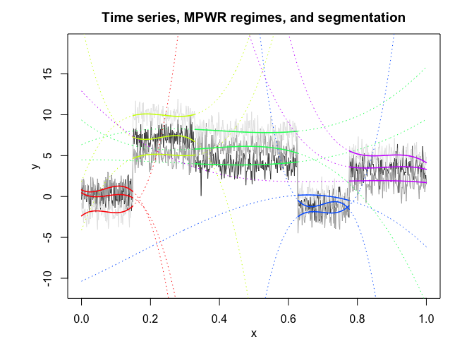
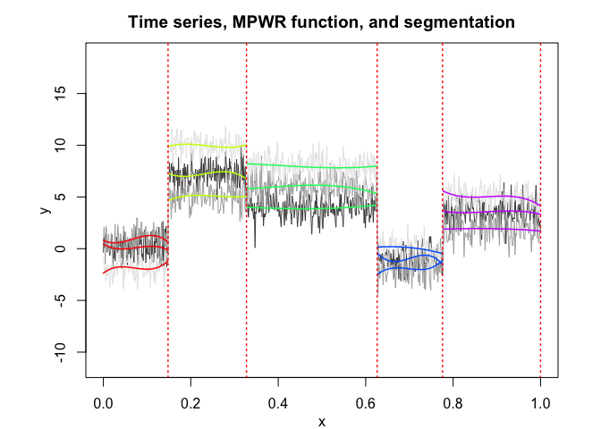
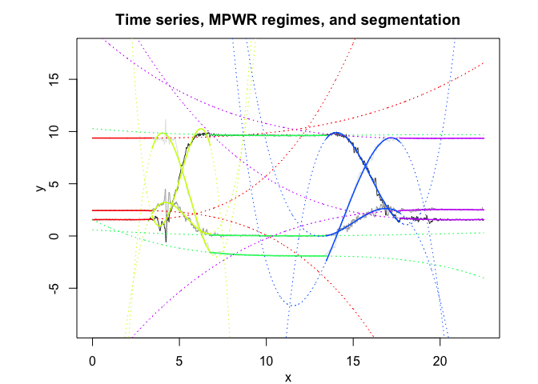
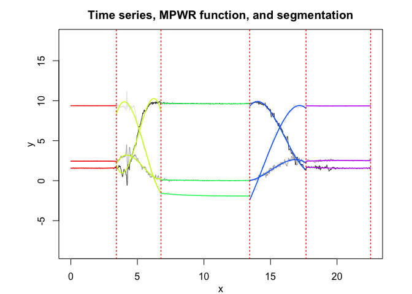

<!-- README.md is generated from README.Rmd. Please edit that file -->
<!-- badges: start -->
<!-- badges: end -->
Overview
========

**MPWR** is an R package for multivariate time series (or multivariate structured longitudinal data) modeling and optimal segmentation via multiple polynomial piecewise regression (MPWR). It uses MLE for the estimation of the regression parameters with dynamic programming for the segmentation.

Installation
============

You can install the MPWR package from [GitHub](https://github.com/fchamroukhi/MPWR_r) with:

``` r
# install.packages("devtools")
devtools::install_github("fchamroukhi/MPWR_r")
```

To build *vignettes* for examples of usage, type the command below instead:

``` r
# install.packages("devtools")
devtools::install_github("fchamroukhi/MPWR_r", 
                         build_opts = c("--no-resave-data", "--no-manual"), 
                         build_vignettes = TRUE)
```

Use the following command to display vignettes:

``` r
browseVignettes("MPWR")
```

Usage
=====

``` r
library(MPWR)
```

``` r
# Application to a toy data set
data("toydataset")
x <- toydataset$x
Y <- as.matrix(toydataset[,c("y1", "y2", "y3")])

K <- 5 # Number of segments
p <- 3 # Polynomial degree

mpwr <- fitMPWR(X = x, Y = Y, K, p)

mpwr$summary()
#> ---------------------
#> Fitted MPWR model
#> ---------------------
#> 
#> MPWR model with K = 5 components:
#> 
#> Clustering table (Number of observations in each regimes):
#> 
#>   1   2   3   4   5 
#> 100 120 200 100 150 
#> 
#> 
#> -----------------
#> Regime 1 (k = 1):
#> 
#> Regression coefficients:
#> 
#>       Beta(d = 1)   Beta(d = 2) Beta(d = 3)
#> 1       0.4474133     0.8114824   -2.368242
#> X^1   -25.5727846   -20.6848653   32.839138
#> X^2   414.9354880   499.4546427 -542.866462
#> X^3 -1816.2465442 -2484.0611667 2530.294227
#> 
#> Covariance matrix:
#>                                    
#>  1.17712603  0.11140579  0.07303982
#>  0.11140579  0.83941499 -0.02442203
#>  0.07303982 -0.02442203  0.85240344
#> -----------------
#> Regime 2 (k = 2):
#> 
#> Regression coefficients:
#> 
#>     Beta(d = 1) Beta(d = 2) Beta(d = 3)
#> 1      21.31547   -4.118748    1.825731
#> X^1  -200.04396  113.095142  112.426768
#> X^2   906.36271 -450.243018 -494.653402
#> X^3 -1317.46869  582.074591  695.919633
#> 
#> Covariance matrix:
#>                                     
#>   1.0409636 -0.180846997 0.137540408
#>  -0.1808470  1.042158071 0.009681258
#>   0.1375404  0.009681258 0.754132443
#> -----------------
#> Regime 3 (k = 3):
#> 
#> Regression coefficients:
#> 
#>     Beta(d = 1) Beta(d = 2) Beta(d = 3)
#> 1     4.4706669    9.345977    6.347632
#> X^1   0.7561632  -33.293454   17.850830
#> X^2 -11.9495386   96.685185  -51.113538
#> X^3  16.1700162  -85.921079   42.778071
#> 
#> Covariance matrix:
#>                                     
#>   1.02025455 -0.04094228 -0.02545433
#>  -0.04094228  1.15658047  0.02852561
#>  -0.02545433  0.02852561  0.99749546
#> -----------------
#> Regime 4 (k = 4):
#> 
#> Regression coefficients:
#> 
#>     Beta(d = 1) Beta(d = 2) Beta(d = 3)
#> 1      1292.041   -856.9321   -10.35385
#> X^1   -5565.070   3684.2135    19.29967
#> X^2    7964.811  -5284.7369    14.51726
#> X^3   -3790.640   2523.4936   -29.61968
#> 
#> Covariance matrix:
#>                                     
#>   0.82213717  0.00680642 -0.03667013
#>   0.00680642  1.09334196 -0.07477891
#>  -0.03667013 -0.07477891  0.85425249
#> -----------------
#> Regime 5 (k = 5):
#> 
#> Regression coefficients:
#> 
#>     Beta(d = 1) Beta(d = 2) Beta(d = 3)
#> 1      195.1972    12.91435     484.847
#> X^1   -659.8533   -45.84299   -1638.373
#> X^2    754.6710    62.05059    1862.017
#> X^3   -286.6935   -27.42044    -704.355
#> 
#> Covariance matrix:
#>                                  
#>  1.12827279 0.25684915 0.02034986
#>  0.25684915 1.21055926 0.04414336
#>  0.02034986 0.04414336 0.77644287

mpwr$plot()
```



``` r
# Application to a real data set (human activity recogntion data)
data("realdataset")

x <- realdataset$x
Y <- as.matrix(realdataset[,c("y1", "y2", "y3")])

K <- 5 # Number of segments
p <- 3 # Polynomial degree

mpwr <- fitMPWR(X = x, Y = Y, K, p)

mpwr$summary()
#> ---------------------
#> Fitted MPWR model
#> ---------------------
#> 
#> MPWR model with K = 5 components:
#> 
#> Clustering table (Number of observations in each regimes):
#> 
#>   1   2   3   4   5 
#> 343 335 667 423 485 
#> 
#> 
#> -----------------
#> Regime 1 (k = 1):
#> 
#> Regression coefficients:
#> 
#>      Beta(d = 1)  Beta(d = 2)   Beta(d = 3)
#> 1    1.560185339  2.436736880  9.3759254766
#> X^1  0.031757430 -0.013118656  0.0022353338
#> X^2 -0.029246827  0.014785102 -0.0029660706
#> X^3  0.006817707 -0.003720884  0.0007588487
#> 
#> Covariance matrix:
#>                                           
#>   3.804381e-04 -6.347547e-05  1.145850e-05
#>  -6.347547e-05  1.518183e-04 -2.400721e-05
#>   1.145850e-05 -2.400721e-05  7.131206e-05
#> -----------------
#> Regime 2 (k = 2):
#> 
#> Regression coefficients:
#> 
#>     Beta(d = 1) Beta(d = 2)  Beta(d = 3)
#> 1    152.876126 -51.6307852 -101.7640938
#> X^1  -99.280212  33.0383816   68.3336097
#> X^2   20.838377  -6.4071123  -13.2834754
#> X^3   -1.376692   0.3927075    0.7941306
#> 
#> Covariance matrix:
#>                                    
#>  0.234496465 0.01028499 0.003237261
#>  0.010284994 0.17150241 0.034012464
#>  0.003237261 0.03401246 0.173280983
#> -----------------
#> Regime 3 (k = 3):
#> 
#> Regression coefficients:
#> 
#>       Beta(d = 1)   Beta(d = 2)  Beta(d = 3)
#> 1   10.2836153396  5.850804e-01  1.553479606
#> X^1 -0.1473590788 -1.117067e-01 -0.837211380
#> X^2  0.0102792674  6.430785e-03  0.068044546
#> X^3 -0.0002175552 -8.980275e-05 -0.001859245
#> 
#> Covariance matrix:
#>                                           
#>   0.0006488799 -1.218436e-04  1.883261e-04
#>  -0.0001218436  1.380695e-03 -7.025104e-05
#>   0.0001883261 -7.025104e-05  2.431844e-03
#> -----------------
#> Regime 4 (k = 4):
#> 
#> Regression coefficients:
#> 
#>       Beta(d = 1) Beta(d = 2)  Beta(d = 3)
#> 1   -1029.8101854 334.7531623  466.4950948
#> X^1   199.9337269 -68.7757987 -105.7225685
#> X^2   -12.6537117   4.6522956    7.6607709
#> X^3     0.2626711  -0.1032888   -0.1778595
#> 
#> Covariance matrix:
#>                                       
#>   0.058681324 -0.017669792 0.002130003
#>  -0.017669792  0.047589263 0.007854147
#>   0.002130003  0.007854147 0.067134426
#> -----------------
#> Regime 5 (k = 5):
#> 
#> Regression coefficients:
#> 
#>      Beta(d = 1)   Beta(d = 2)  Beta(d = 3)
#> 1   26.839286686 -14.419457932 19.760634802
#> X^1 -3.470505723   2.286275938 -1.514079293
#> X^2  0.158288202  -0.101799143  0.073143231
#> X^3 -0.002398072   0.001493312 -0.001173409
#> 
#> Covariance matrix:
#>                                           
#>   0.0069094075 -0.0011760419  0.0000291898
#>  -0.0011760419  0.0035957112 -0.0002395346
#>   0.0000291898 -0.0002395346  0.0005572795

mpwr$plot()
```


